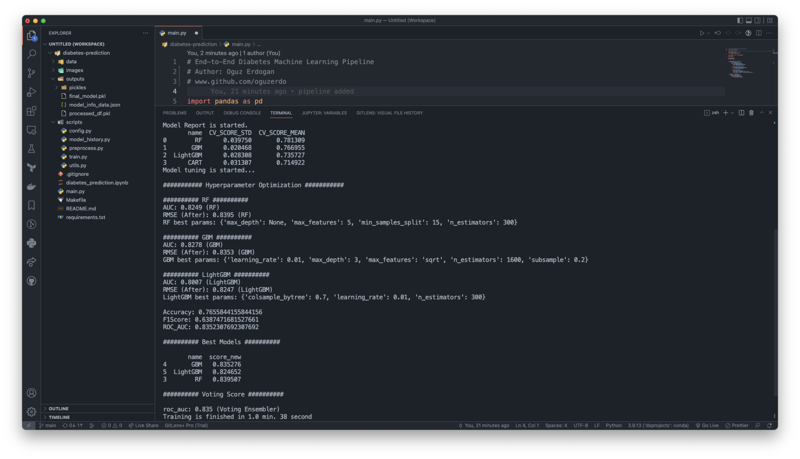

# Diabetes Prediction Machine Learning Pipeline


# Business Problem

Develop a machine learning model that can predict whether people have diabetes when their characteristics are specified

This dataset is originally from the National Institute of Diabetes and Digestive and Kidney Diseases.

The objective of the dataset is to diagnostically predict whether or not a patient has diabetes, based on certain diagnostic measurements included in the dataset. Several constraints were placed on the selection of these instances from a larger database. In particular, all patients here are **females at least 21 years old of Pima Indian heritage.**

# Dataset Info

The datasets consists of several medical predictor variables and one target variable, Outcome. Predictor variables includes the number of pregnancies the patient has had, their BMI, insulin level, age, and so on.

**Number of Observation Units:** 768

**Variable Number:** 9

| Feature | Definition |
| --- | --- |
| Pregnancies | Number of times pregnant |
| Glucose | Plasma glucose concentration a 2 hours in an oral glucose tolerance test |
| BloodPressure | Diastolic blood pressure (mm Hg) |
| SkinThickness | Triceps skin fold thickness (mm) |
| Insulin | 2-Hour serum insulin (mu U/ml) |
| BMI | Body mass index (weight in kg/(height in m)^2) |
| DiabetesPedigreeFunction | Diabetes pedigree function |
| Age | Age (years) |
| Outcome | Class variable ( 0 - 1) |


# Usage 
**Script Modes:**
```
--no-debug: Runs full script
--no-tuning: Runs script without tuning
--model-history: Shows models parameters and RMSE scores
```
# Make Commands
To run script with make commands first install MakeFile application on your IDE then run like:

```
run: Runs full script with tuning

debug: Runs script with debug mode (Set number of row option on scripts/config.file)

notuning: Runs script without tuning

req: Creates requirements.txt

install: Installs requirements.txt

models: Shows models parameters and RMSE scores
```


# Files

- [*diabetes-prediction.ipynb*](https://github.com/oguzerdo/diabetes-prediction/blob/main/diabetes_prediction.ipynb) - Project Notebook
- [*main.py*](https://github.com/oguzerdo/diabetes-prediction-ml-pipeline/blob/main/main.py) - Main script  

- [*configs.py*](https://github.com/oguzerdo/diabetes-prediction-ml-pipeline/blob/main/scripts/config.py) - Configuration Files (Grid & Project settings)
- [*model_history.py*](https://github.com/oguzerdo/diabetes-prediction/blob/main/helpers.py) - Show model validation scores from model_info_data.json file
- [*preprocess.py*](https://github.com/oguzerdo/diabetes-prediction-ml-pipeline/blob/main/scripts/preprocess.py) - Data Preparation script
- [*train.py*](https://github.com/oguzerdo/diabetes-prediction-ml-pipeline/blob/main/scripts/train.py) - Model Training with Debug option
- [*utils.py*](https://github.com/oguzerdo/diabetes-prediction-ml-pipeline/blob/main/scripts/utils.py) - Helper functions

- [*outputs*](https://github.com/oguzerdo/diabetes-prediction-ml-pipeline/tree/main/outputs) - Output files, includes model pkl objects and model validation history

# Requirements

```
joblib==1.1.0
lightgbm==3.1.1
matplotlib==3.5.2
numpy==1.22.3
pandas==1.4.4
scikit_learn==1.1.2
seaborn==0.11.2
xgboost==1.5.0
```

## Author

- Oğuz Erdoğan - [oguzerdo](www.oguzerdogan.com)
